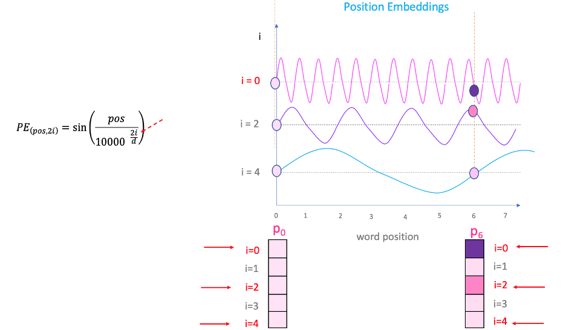

# Building GPT from scratch in PyTorch via understanding from Karpathy's tutorials

Andrej Karpathy is one of the pioneers in Machine learning who served as the director of artificial intelligence and Autopilot Vision at Tesla. He currently works for OpenAI, where he specializes in deep learning and computer vision. He is well known for amazing tutorials explained via code sessions on YouTube and for his landmark well curated lectures in Stanford University.

Generative Pre-trained Transformers have set the world of AI and Machine learning on fire in this decade. Open AI's GPT models have set teh world ablaze for it's nearly accurate human mimicking abilities among certain natural language tasks such as text summarization, code interpretation, text generation and translation.

In this blog, I delve to capture the important notes as I dig into code explained and orchestrated by Karpathy in his youtube session. I played around with this code and also trained on a tiny Kannada data set taken from Wikipedia (for the lack of any other open license datasets).

## Youtube link for lecture by Karpathy
[Youtube session by Karpathy on building a GPT](https://www.youtube.com/watch?v=kCc8FmEb1nY&list=PLAqhIrjkxbuWI23v9cThsA9GvCAUhRvKZ&index=7&t=13s)


## Transformer
Transformer is the neural network that does all the heavy lifting. Its genesis lies in the paper in 2017 that was written by Ashish Vaswani et al at Google called "Attention is all you need".

## Intro notes from Karpathy's session
Karpathy lays down the agenda, that the goal of his session is not to build Chat-GPT, because it is a serious production grade system that leverages models pre-trained on internet data and chunks of documents. 

So instead we learn how to build transformer based language model at character level.


## Datasets used
Tiny Shakespeare data, which is collection of all shakespeare's work in single file.

## nanoGPT
It is a repository for training transformers written by karpathy. This trained on open web text can mimic performance of gpt2, by open ai.

## Constructing a language model to generate texts (characters)

* Loading the dataset: Read the tiny shakespeare dataset into a string.
* Take set of string in step 1, meaning only unique characters from whole corpus is taken.
* List on the set of characters created in the step 2 is created.
* Sorting the list created in step 3, gives an ordering of all the characters in the tiny Shakespeare dataset.

### Vocabulary Size
* Number of characters obtained in step 4 earlier is going to be the vocabulary size.
* These are going to be possible elements of our sequence.
* Vocabulary is the possible set of characters the model can see or emit.

### Tokenizer
* Tokenizer means converting vocabulary to some integers.
* Here we convert characters to integers using vocabulary constructed above.

 Google's `Sentencepiece` encodes text into integers, but in different schema and using different vocabulary. It is a sub-word tokenizer. This means that you are not encoding words or characters, but sub-words

 Open ai uses `Tiktoken` library which uses Byte Pair Encoding (BPE) to encode tokens. This is what GPT uses.

 ```
	enc = tiktoken.get_encoding("gpt2")
	enc.n_vocab
  ```

  this tells that open ai has 50k+ sized vocabulary.


  ### Training and validation data
  The 90% of data is broken into train and other 10% into validation dataset.

  ## Transformer training
  The data chunks are sampled at random from the training set during training. These chunks have a maximum length. that is called as block size. You can find it as different names like context length.

  X is the input to the transformer.
  Y is the next block size characters from 1 to block_size + 1.


### Preparation script
https://github.com/karpathy/nanoGPT/blob/eba36e84649f3c6d840a93092cb779a260544d08/data/shakespeare_char/prepare.py


### Trainer
For each batch size of 4, we loop through block size tensors of inputs and targets.


## Bigram baseline language model
Next, he shows how to implement a bigram language model using PyTorch framework.
BigramLanguageModel is implemented as a subclass of nn.Module from PyTorch
We construct a lookup embedding table using vocab_size which is the size of the vocabulary.
* Logits are obtained from this table using index (idx).
* Understand what nn.Module forward pass does.
* Understand what cross entropy of nn.Module does


## Training the model
* AdamW optimizer is selected
* Learning rate is kept as 10^-3
* Batch size of 4 is increased to 32,and steps loop of 100 is attempted
* At each step, we sample batch of data from train data created earlier.
* Logits and loss is computed 

`optimizer.zero_grad` - this if set to set_to_none = True will stop gradients from updating the parameters

If we run for 100 iterations and print out the loss, if it is decreasing, it seems optimization is definitely happening.

bigram script is ported to py.


```
    import torch
    import torch.nn as nn
    from torch.nn import functional as F
    torch.manual_seed(1337)

    class BigramLanguageModel(nn.Module):

        def __init__(self, vocab_size):
            super().__init__()
            # each token directly reads off the logits for the next token from a lookup table
            self.token_embedding_table = nn.Embedding(vocab_size, vocab_size)

        def forward(self, idx, targets=None):

            # idx and targets are both (B,T) tensor of integers
            logits = self.token_embedding_table(idx) # (B,T,C)
            
            if targets is None:
                loss = None
            else:
                B, T, C = logits.shape
                logits = logits.view(B*T, C)
                targets = targets.view(B*T)
                loss = F.cross_entropy(logits, targets)

            return logits, loss
        
        def generate(self, idx, max_new_tokens):
            # idx is (B, T) array of indices in the current context
            for _ in range(max_new_tokens):
                # get the predictions
                logits, loss = self(idx)
                # focus only on the last time step
                logits = logits[:, -1, :] # becomes (B, C)
                # apply softmax to get probabilities
                probs = F.softmax(logits, dim=-1) # (B, C)
                # sample from the distribution
                idx_next = torch.multinomial(probs, num_samples=1) # (B, 1)
                # append sampled index to the running sequence
                idx = torch.cat((idx, idx_next), dim=1) # (B, T+1)
            return idx

    m = BigramLanguageModel(vocab_size)
    logits, loss = m(xb, yb)
    print(logits.shape)
    print(loss)

    print(decode(m.generate(idx = torch.zeros((1, 1), dtype=torch.long), max_new_tokens=100)[0].tolist()))
```

 The code implements a bigram language model using PyTorch. A bigram language model is a statistical language model that predicts the next word in a sequence based on the previous word.

The model consists of an embedding layer and a linear layer. 
The embedding layer converts each word in the vocabulary into a vector of real numbers. 
The linear layer then takes the vector representation of the previous word and predicts the probability distribution of the next word.

The forward method of the model takes two arguments:

* `idx`: A tensor of integers representing the indices of the words in the current context.
* `targets` (optional): A tensor of integers representing the indices of the target words.

If `targets` is not provided, the model simply returns the logits for the next word. 
Otherwise, the model computes the cross-entropy loss between the logits and the targets.

The generate method of the model takes two arguments:

* `idx`: A tensor of integers representing the indices of the words in the current context.
* `max_new_tokens`: The maximum number of new tokens to generate.

The generate method uses the model to generate a sequence of words. It starts by generating the first word in the sequence, then uses the model to predict the next word, and so on. The method stops generating words when it reaches the maximum number of new tokens.

The following is an example of how to use the model:

```
    import torch
    import torch.nn as nn
    from torch.nn import functional as F

    # Create a bigram language model with a vocabulary size of 10000.
    model = BigramLanguageModel(vocab_size=10000)

    # Generate a sequence of 100 words.
    idx = torch.zeros((1, 1), dtype=torch.long)
    generated_words = model.generate(idx, max_new_tokens=100)

    # Print the generated words.
    print(decode(generated_words[0].tolist()))
```

This code will print a sequence of 100 words that were generated by the model.


## Building a transformer that can generate characters

In the code below, we explain transformer based model iterating and fine tuning the baseline bigram model developed above.

```
    import torch
    import torch.nn as nn
    from torch.nn import functional as F

    #hyperparameters
    batch_size = 16 # how many independent sequences will we process in parallel?
    block_size = 32 # what is the maximum context length for predictions?
    max_iters = 5000
    eval_interval = 100
    learning_rate = 1e-3
    device = 'cuda' if torch.cuda.is_available() else 'cpu'
    eval_iters = 200
    n_embd = 64
    n_head = 4
    n_layer = 4
    dropout = 0.0
    # ------------

    torch.manual_seed(1337)


    #here are all the unique characters that occur in this text
    chars = sorted(list(set(text)))
    vocab_size = len(chars)
    #create a mapping from characters to integers
    stoi = { ch:i for i,ch in enumerate(chars) }
    itos = { i:ch for i,ch in enumerate(chars) }
    encode = lambda s: [stoi[c] for c in s] # encoder: take a string, output a list of integers
    decode = lambda l: ''.join([itos[i] for i in l]) # decoder: take a list of integers, output a string

    #Train and test splits
    data = torch.tensor(encode(text), dtype=torch.long)
    n = int(0.9*len(data)) # first 90% will be train, rest val
    train_data = data[:n]
    val_data = data[n:]

    #data loading
    def get_batch(split):
        # generate a small batch of data of inputs x and targets y
        data = train_data if split == 'train' else val_data
        ix = torch.randint(len(data) - block_size, (batch_size,))
        x = torch.stack([data[i:i+block_size] for i in ix])
        y = torch.stack([data[i+1:i+block_size+1] for i in ix])
        x, y = x.to(device), y.to(device)
        return x, y

    @torch.no_grad()
    def estimate_loss():
        out = {}
        model.eval()
        for split in ['train', 'val']:
            losses = torch.zeros(eval_iters)
            for k in range(eval_iters):
                X, Y = get_batch(split)
                logits, loss = model(X, Y)
                losses[k] = loss.item()
            out[split] = losses.mean()
        model.train()
        return out

    class Head(nn.Module):
        """ one head of self-attention """

        def __init__(self, head_size):
            super().__init__()
            self.key = nn.Linear(n_embd, head_size, bias=False)
            self.query = nn.Linear(n_embd, head_size, bias=False)
            self.value = nn.Linear(n_embd, head_size, bias=False)
            self.register_buffer('tril', torch.tril(torch.ones(block_size, block_size)))

            self.dropout = nn.Dropout(dropout)

        def forward(self, x):
            B,T,C = x.shape
            k = self.key(x)   # (B,T,C)
            q = self.query(x) # (B,T,C)
            # compute attention scores ("affinities")
            wei = q @ k.transpose(-2,-1) * C**-0.5 # (B, T, C) @ (B, C, T) -> (B, T, T)
            wei = wei.masked_fill(self.tril[:T, :T] == 0, float('-inf')) # (B, T, T)
            wei = F.softmax(wei, dim=-1) # (B, T, T)
            wei = self.dropout(wei)
            # perform the weighted aggregation of the values
            v = self.value(x) # (B,T,C)
            out = wei @ v # (B, T, T) @ (B, T, C) -> (B, T, C)
            return out

    class MultiHeadAttention(nn.Module):
        """ multiple heads of self-attention in parallel """

        def __init__(self, num_heads, head_size):
            super().__init__()
            self.heads = nn.ModuleList([Head(head_size) for _ in range(num_heads)])
            self.proj = nn.Linear(n_embd, n_embd)
            self.dropout = nn.Dropout(dropout)

        def forward(self, x):
            out = torch.cat([h(x) for h in self.heads], dim=-1)
            out = self.dropout(self.proj(out))
            return out

    class FeedFoward(nn.Module):
        """ a simple linear layer followed by a non-linearity """

        def __init__(self, n_embd):
            super().__init__()
            self.net = nn.Sequential(
                nn.Linear(n_embd, 4 * n_embd),
                nn.ReLU(),
                nn.Linear(4 * n_embd, n_embd),
                nn.Dropout(dropout),
            )

        def forward(self, x):
            return self.net(x)

    class Block(nn.Module):
        """ Transformer block: communication followed by computation """

        def __init__(self, n_embd, n_head):
            # n_embd: embedding dimension, n_head: the number of heads
            super().__init__()
            head_size = n_embd // n_head
            self.sa = MultiHeadAttention(n_head, head_size)
            self.ffwd = FeedFoward(n_embd)
            self.ln1 = nn.LayerNorm(n_embd)
            self.ln2 = nn.LayerNorm(n_embd)

        def forward(self, x):
            x = x + self.sa(self.ln1(x))
            x = x + self.ffwd(self.ln2(x))
            return x

    # super simple bigram model
    class BigramLanguageModel(nn.Module):

        def __init__(self):
            super().__init__()
            # each token directly reads off the logits for the next token from a lookup table
            self.token_embedding_table = nn.Embedding(vocab_size, n_embd)
            self.position_embedding_table = nn.Embedding(block_size, n_embd)
            self.blocks = nn.Sequential(*[Block(n_embd, n_head=n_head) for _ in range(n_layer)])
            self.ln_f = nn.LayerNorm(n_embd) # final layer norm
            self.lm_head = nn.Linear(n_embd, vocab_size)

        def forward(self, idx, targets=None):
            B, T = idx.shape

            # idx and targets are both (B,T) tensor of integers
            tok_emb = self.token_embedding_table(idx) # (B,T,C)
            pos_emb = self.position_embedding_table(torch.arange(T, device=device)) # (T,C)
            x = tok_emb + pos_emb # (B,T,C)
            x = self.blocks(x) # (B,T,C)
            x = self.ln_f(x) # (B,T,C)
            logits = self.lm_head(x) # (B,T,vocab_size)

            if targets is None:
                loss = None
            else:
                B, T, C = logits.shape
                logits = logits.view(B*T, C)
                targets = targets.view(B*T)
                loss = F.cross_entropy(logits, targets)

            return logits, loss

        def generate(self, idx, max_new_tokens):
            # idx is (B, T) array of indices in the current context
            for _ in range(max_new_tokens):
                # crop idx to the last block_size tokens
                idx_cond = idx[:, -block_size:]
                # get the predictions
                logits, loss = self(idx_cond)
                # focus only on the last time step
                logits = logits[:, -1, :] # becomes (B, C)
                # apply softmax to get probabilities
                probs = F.softmax(logits, dim=-1) # (B, C)
                # sample from the distribution
                idx_next = torch.multinomial(probs, num_samples=1) # (B, 1)
                # append sampled index to the running sequence
                idx = torch.cat((idx, idx_next), dim=1) # (B, T+1)
            return idx

    model = BigramLanguageModel()
    m = model.to(device)
    # print the number of parameters in the model
    print(sum(p.numel() for p in m.parameters())/1e6, 'M parameters')

    # create a PyTorch optimizer
    optimizer = torch.optim.AdamW(model.parameters(), lr=learning_rate)

    for iter in range(max_iters):

        # every once in a while evaluate the loss on train and val sets
        if iter % eval_interval == 0 or iter == max_iters - 1:
            losses = estimate_loss()
            print(f"step {iter}: train loss {losses['train']:.4f}, val loss {losses['val']:.4f}")

        # sample a batch of data
        xb, yb = get_batch('train')

        # evaluate the loss
        logits, loss = model(xb, yb)
        optimizer.zero_grad(set_to_none=True)
        loss.backward()
        optimizer.step()

    # generate from the model
    context = torch.zeros((1, 1), dtype=torch.long, device=device)
    print(decode(m.generate(context, max_new_tokens=2000)[0].tolist()))
```


This code implements a transformer-based language model for text generation. Here's a simplified explanation:

1. **Data Preparation**:
   - The text is tokenized into a sequence of integers, where each integer represents a unique character.
   - The data is split into training and validation sets.

2. **Model Architecture**:
   - The model consists of multiple layers of transformer blocks.
   - Each transformer block contains a self-attention layer and a feed-forward layer.
   - The self-attention layer allows the model to learn relationships between different parts of the input sequence.
   - The feed-forward layer adds non-linearity to the model.

3. **Training**:
   - The model is trained using the AdamW optimizer.
   - During training, the model learns to predict the next character in a sequence given the previous characters.
   - The loss function is the cross-entropy loss between the predicted probabilities and the actual next character.

4. **Evaluation**:
   - The model's performance is evaluated on the validation set periodically during training.
   - The evaluation metric is the average loss over a set of validation examples.

5. **Generation**:
   - After training, the model can generate new text by starting with a short sequence of characters and then predicting the next characters one by one.
   - The model uses a greedy decoding strategy, where it always chooses the most likely next character.

Here's an example of how the model can generate text:

```
context = torch.zeros((1, 1), dtype=torch.long, device=device)
print(decode(m.generate(context, max_new_tokens=2000)[0].tolist()))
```

This code generates a sequence of 2000 characters starting from an empty context. The generated text is then decoded from the sequence of integers back to a string.

The model can generate coherent and meaningful text, but it may contain occasional errors or repetitions. This is because the model is trained on a limited dataset and may not have seen all possible combinations of characters.


## Hyperparameters

### block size
A larger `block_size` allows the model to consider a longer context when making predictions, which can improve the quality of the generated text. However, a larger `block_size` also increases the computational cost of training and inference.

In the provided code, the `block_size` is set to 32, which is a common choice for text generation tasks.


 **n_embd**: This hyperparameter specifies the dimension of the embedding vectors used to represent the input characters. A larger embedding dimension allows the model to capture more information about each character, but it also increases the computational cost of training and inference.

**n_head**: This hyperparameter specifies the number of attention heads in the transformer blocks. Each attention head learns to attend to different parts of the input sequence, allowing the model to capture different types of relationships between characters. A larger number of attention heads can improve the model's performance, but it also increases the computational cost.

**n_layer**: This hyperparameter specifies the number of transformer blocks in the model. Each transformer block consists of a self-attention layer and a feed-forward layer. A larger number of layers can improve the model's performance, but it also increases the computational cost.

**dropout**: This hyperparameter specifies the dropout rate used to prevent overfitting. Dropout randomly drops out some of the neurons in the model during training, which helps to prevent the model from learning too much from the training data and generalizing poorly to new data. A higher dropout rate can help to prevent overfitting, but it can also reduce the model's performance.

**batch size**: The batch size determines how many independent sequences the model will process in parallel during training and inference. A larger batch size can improve the efficiency of training and inference, but it can also increase the memory requirements.

**block_size**: The block size determines the maximum context length for predictions. In the transformer-based language model, the model can only process sequences of length `block_size` at a time. A larger block size allows the model to consider a longer context when making predictions, which can improve the quality of the generated text. However, a larger block size also increases the computational cost of training and inference.

**max_iters**: The `max_iters` hyperparameter specifies the maximum number of iterations for training the model. One iteration consists of a forward pass through the model on a batch of data, followed by a backward pass to compute the gradients of the loss function with respect to the model's parameters. The model is trained for a fixed number of iterations, or until it reaches a desired level of performance.

In the provided code, the hyperparameters are set to the following values:

* `batch_size = 16`
* `block_size = 32`
* `max_iters = 5000`

These values are common choices for text generation tasks, but they can be tuned to optimize the model's performance on a specific dataset.

Here's an example to illustrate the difference between `batch_size` and `block_size`:

Consider a dataset of text sequences, where each sequence is 100 characters long.

* If the `batch_size` is set to 16 and the `block_size` is set to 32, then the model will process 16 sequences of length 32 in parallel during each iteration.
* If the `batch_size` is set to 32 and the `block_size` is set to 16, then the model will process 32 sequences of length 16 in parallel during each iteration.

The choice of `batch_size` and `block_size` depends on the available computational resources and the desired trade-off between efficiency and performance.


## Embedding table

What does this do ? 
token_embedding_table = nn.Embedding(vocab_size, n_embd)

The line `token_embedding_table = nn.Embedding(vocab_size, n_embd)` creates an embedding table for the input tokens in the transformer-based language model. Here's how it works:

* **Embedding Table**: An embedding table is a lookup table that maps each token in the vocabulary to a fixed-size vector. The size of the embedding vector is specified by the `n_embd` hyper-parameter.

* **Vocabulary Size**: The `vocab_size` parameter specifies the number of unique tokens in the vocabulary. In this case, the vocabulary size is equal to the number of unique characters in the text dataset.

* **Embedding Dimension**: The `n_embd` parameter specifies the dimension of the embedding vectors. A larger embedding dimension allows the model to capture more information about each token, but it also increases the computational cost of training and inference.

When the model processes a sequence of tokens, it first looks up the corresponding embedding vectors in the embedding table. These embedding vectors are then used as input to the transformer blocks.

The embedding table is a learned parameter of the model. During training, the model learns to adjust the embedding vectors to better represent the relationships between tokens.

Here's an example to illustrate how the embedding table works:

Consider a vocabulary of 100 unique characters. The embedding dimension is set to 64.

* The embedding table is a 2-dimensional matrix with 100 rows and 64 columns.
* Each row in the embedding table corresponds to a unique character in the vocabulary.
* Each column in the embedding table represents a dimension of the embedding vector.

When the model processes a sequence of characters, it looks up the corresponding embedding vectors in the embedding table. For example, if the sequence is "hello", the model would look up the embedding vectors for the characters 'h', 'e', 'l', 'l', and 'o'.

These embedding vectors are then used as input to the transformer blocks. The transformer blocks learn to combine the embedding vectors in a way that captures the relationships between the characters in the sequence.

The embedding table is a crucial component of the transformer-based language model. It allows the model to represent the input tokens in a way that is suitable for learning long-range dependencies in the text.


## What is the purpose of position embedding table

position_embedding_table = nn.Embedding(block_size, n_embd)
 The purpose of the position embedding table is to encode the position of each token in a sequence. This is important because the transformer model, which the position embedding table is a part of, is an attention-based model, and the attention mechanism relies on knowing the relative positions of the tokens in the sequence in order to determine which tokens to attend to.

The position embedding table is a learned embedding table, which means that its weights are updated during training. This allows the model to learn the optimal way to encode the positional information of the tokens in the sequence.

The dimension of the position embedding table is typically the same as the dimension of the token embeddings, which is typically 512 or 1024. This means that each token in the sequence is represented by a vector of 512 or 1024 numbers, which includes both the token embedding and the position embedding.

The position embedding table is added to the token embeddings before the transformer model is applied. This allows the model to learn to attend to the tokens in the sequence in a way that is informed by their positions.

Here is a diagram that shows how the position embedding table is used in the transformer model:



https://datascience.stackexchange.com/questions/51065/what-is-the-positional-encoding-in-the-transformer-model

The position embedding table is a key part of the transformer model, and it allows the model to learn to attend to the tokens in a sequence in a way that is informed by their positions. This is essential for the model to be able to understand the meaning of the sequence.

Great video that helped me understand this visually: https://www.youtube.com/watch?v=dichIcUZfOw


## Block in a transformer


 A block in a Transformer model is a building block that performs two main operations: communication and computation. Here's a simplified explanation with an example:
```
    class Block(nn.Module):
        """ Transformer block: communication followed by computation """

        def __init__(self, n_embd, n_head):
            # n_embd: embedding dimension, n_head: the number of heads we'd like
            super().__init__()
            head_size = n_embd // n_head
            self.sa = MultiHeadAttention(n_head, head_size)
            self.ffwd = FeedFoward(n_embd)
            self.ln1 = nn.LayerNorm(n_embd)
            self.ln2 = nn.LayerNorm(n_embd)

        def forward(self, x):
            x = x + self.sa(self.ln1(x))
            x = x + self.ffwd(self.ln2(x))
            return x
```

 A block in a Transformer model is a building block that performs two main operations: communication and computation. Here's a simplified explanation with an example:

**Communication:**
- Imagine a group of people (called "heads") standing in a circle, passing messages to each other.
- Each person (head) receives information from everyone else in the circle.
- This communication allows each person to gain a broader understanding of the overall situation.

**Computation:**
- After the communication phase, each person (head) performs some calculations on the information they have gathered.
- They combine and process the information to make better decisions or predictions.

Example:

- Think of a scenario where you're trying to predict the weather.
- The communication phase is like gathering data from weather stations, satellites, and other sources.
- The computation phase is where you process this data to make a prediction about the weather.

In a Transformer model, the blocks are stacked together to form the entire model. Each block communicates and computes to learn patterns and relationships in the data. This allows the model to make predictions or solve problems.


## Attention head

```head_size = n_embd // n_head```

The line `head_size = n_embd // n_head` calculates the size of each attention head in the Transformer block.

- `n_embd` is the embedding dimension, which is the size of the input and output vectors for each block.
- `n_head` is the number of attention heads in the block.

The division (`//`) operator in Python performs integer division, which means it divides two numbers and truncates the result to the nearest whole number.

So, `head_size = n_embd // n_head` calculates the size of each attention head by dividing the embedding dimension by the number of heads. This ensures that the size of each head is an integer, which is required for the attention mechanism to work properly.

For example, if `n_embd` is 512 and `n_head` is 8, then `head_size` will be 512 // 8 = 64. This means that each attention head will have a size of 64.

In general, the size of the attention heads is a hyperparameter that can be tuned to achieve the best performance for a given task.

what is an attentio nhead ? An attention head is a component within a Transformer neural network architecture that allows the model to focus on specific parts of the input data. It helps the model learn relationships and dependencies between different parts of the input.

Here's a simplified analogy to understand attention heads:

Imagine you're reading a long document and trying to understand its main points. You might quickly skim through the document to get a general idea, but then you start to focus on specific sections, sentences, or even words that you find particularly relevant.

Attention heads work in a similar way. They allow the model to focus on important parts of the input data and ignore the less relevant parts. This helps the model learn more effectively and make better predictions.

In a Transformer model, there are multiple attention heads, each focusing on different aspects of the input. The outputs of these attention heads are then combined to create a more comprehensive understanding of the input.

For example, in a natural language processing task, different attention heads might focus on different words or phrases in a sentence. This allows the model to understand the meaning of the sentence and perform tasks like sentiment analysis or machine translation.

The number of attention heads in a Transformer model is a hyper parameter that can be tuned to optimize performance. Typically, more attention heads lead to better performance, but it also increases the computational cost.

Overall, attention heads are important components of Transformer models that enable them to learn relationships and dependencies in the input data and perform complex tasks effectively.


## Head in attention layer in the transformer

```
class Head(nn.Module):
    """ one head of self-attention """

    def __init__(self, head_size):
        super().__init__()
        self.key = nn.Linear(n_embd, head_size, bias=False)
        self.query = nn.Linear(n_embd, head_size, bias=False)
        self.value = nn.Linear(n_embd, head_size, bias=False)
        self.register_buffer('tril', torch.tril(torch.ones(block_size, block_size)))

        self.dropout = nn.Dropout(dropout)

    def forward(self, x):
        B,T,C = x.shape
        k = self.key(x)   # (B,T,C)
        q = self.query(x) # (B,T,C)
        # compute attention scores ("affinities")
        wei = q @ k.transpose(-2,-1) * C**-0.5 # (B, T, C) @ (B, C, T) -> (B, T, T)
        wei = wei.masked_fill(self.tril[:T, :T] == 0, float('-inf')) # (B, T, T)
        wei = F.softmax(wei, dim=-1) # (B, T, T)
        wei = self.dropout(wei)
        # perform the weighted aggregation of the values
        v = self.value(x) # (B,T,C)
        out = wei @ v # (B, T, T) @ (B, T, C) -> (B, T, C)
        return out
```
 In the provided code, the `Head` class represents a single head of a self-attention mechanism within a transformer model. Each head is responsible for calculating attention scores between different positions in a sequence and then using these scores to compute a weighted aggregation of the input sequence.

Here's a breakdown of what each part of the `Head` class does:

1. **Initialization (`__init__` method):**
   - `head_size`: The dimension of the output embeddings from each head.
   - `key`, `query`, and `value`: These are linear layers (also known as projections) that map the input vectors to the key, query, and value vectors used in the attention computation. All of these have the shape `(n_embd, head_size)`.
   - `tril`: A buffer that contains a pre-computed lower triangular matrix of ones. This is used to mask out the diagonal and upper triangular elements in the attention matrix, preventing self-attention at the same position.
   - `dropout`: A dropout layer used for regularization.

2. **Forward Pass (`forward` method):**
   - The forward method takes an input sequence `x` of shape `(B, T, C)`, where `B` is the batch size, `T` is the sequence length, and `C` is the embedding dimension.
   - The linear layers `key`, `query`, and `value` are applied to `x` to obtain the key, query, and value vectors, all of shape `(B, T, head_size)`.
   - The attention scores (`wei`) are calculated by multiplying the query and key vectors and scaling them by `C**-0.5`.
   - The attention scores are masked using the `tril` buffer to prevent self-attention at the same position.
   - The attention scores are normalized using the softmax function along the last dimension, yielding a probability distribution over the sequence positions.
   - Dropout is applied to the attention scores.
   - The value vectors are multiplied by the attention scores, resulting in a weighted aggregation of the input sequence. This weighted sum is the output of the head.

The output of the `Head` class is a sequence of vectors of shape `(B, T, head_size)`. This output is typically concatenated with the outputs of other heads (if there are multiple heads) and linearly transformed to produce the final output of the transformer layer.

The `Head` class allows multiple heads to attend to different aspects of the input sequence simultaneously, capturing diverse relationships between elements in the sequence. This is a key component of the transformer architecture's ability to learn long-range dependencies and perform tasks such as machine translation and language modeling.


## References:

1. [Attention Is All You Need](https://arxiv.org/abs/1706.03762), Ashish Vaswani, Noam Shazeer, Niki Parmar, Jakob Uszkoreit, Llion Jones, Aidan N. Gomez, Lukasz Kaiser, Illia Polosukhin
2. [Dropout: A Simple Way to Prevent Neural Networks from Overfitting](https://www.cs.toronto.edu/~rsalakhu/papers/srivastava14a.pdf), Nitish Srivastava, Geoffrey Hinton, Alex Krizhevsky, Ilya Sutskever, Ruslan Salakhutdinov
3. [Karpathy Nano GPT Lecture Code](https://github.com/karpathy/ng-video-lecture/tree/master), Neural Networks: Zero To Hero video lecture series.